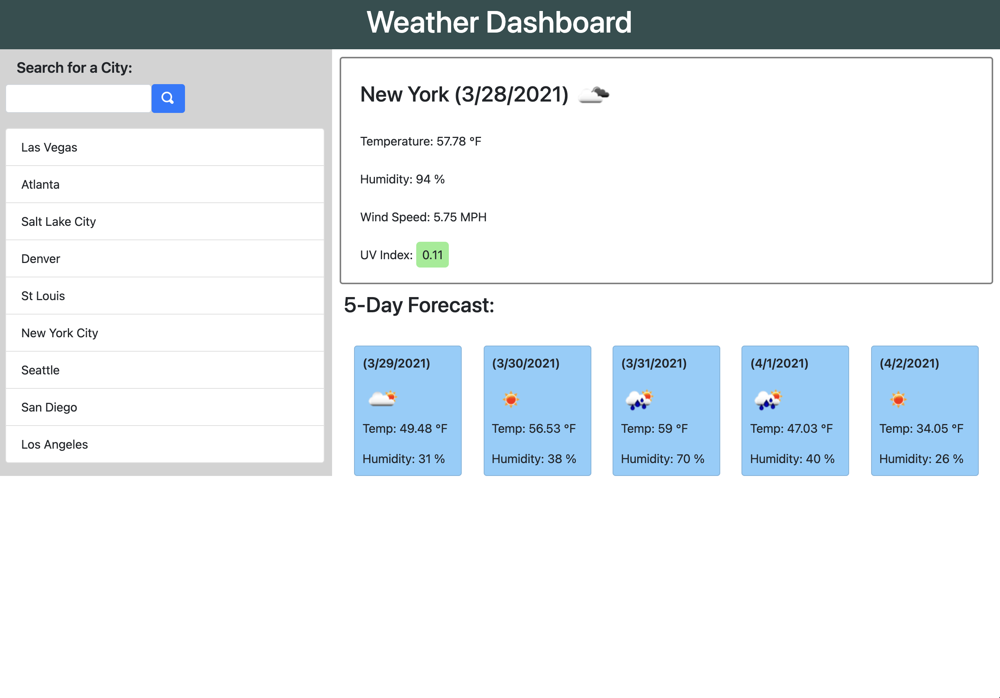
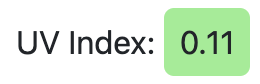
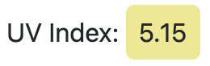
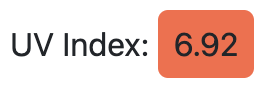

# Weather Dashboard

# Description
This is the module 6 weather dashboard challenge.  
When the page loads for the first time, the weather info for Los Angeles is displayed. However, if there are previous searches stored in localStorage, weather info for the first stored city will be displayed. Users can search for a given city, and the input will be uniformally formatted (ie 'New York') regardless of how it was submitted(uppercase, lowercase). Searched cities are stored in localStorage and displayed in the list below the search form, only if the fetch request was successful and if the city hasn't been searched before. If a city from the list is clicked, the weather info for that city wil be displayed. The UV Index background color will change based on the uv index value, as shown below:

Finally, the 5-day forecast cards are responsive, and will eventually stack on top of each other as the screen size shrinks.

# Languages Used
* HTML
* CSS / Bootstrap
* JavaScript / JQuery

# Link
https://simmonsw.github.io/weather-dashboard/
